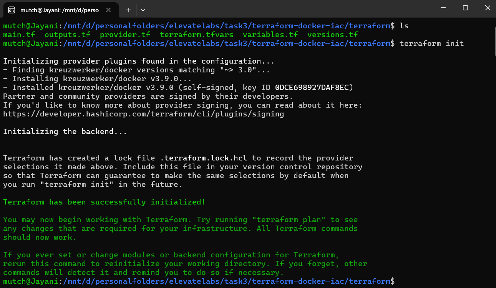
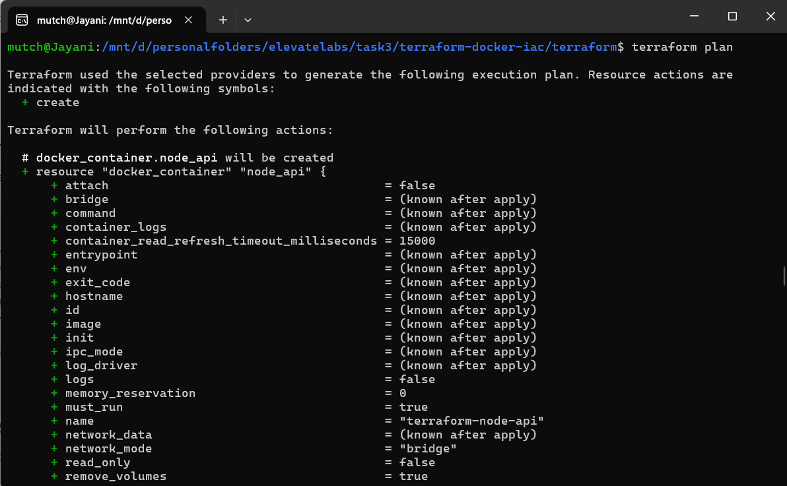
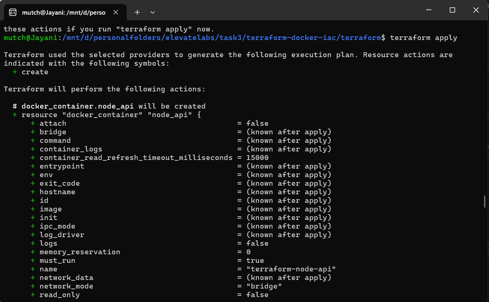
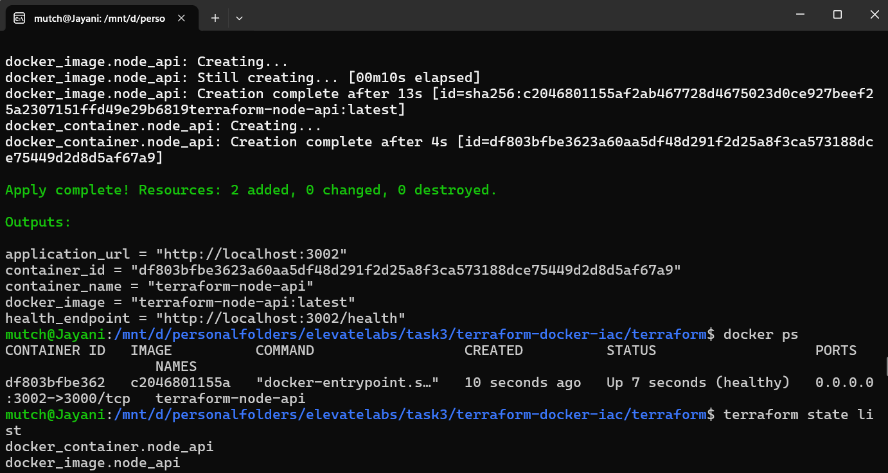
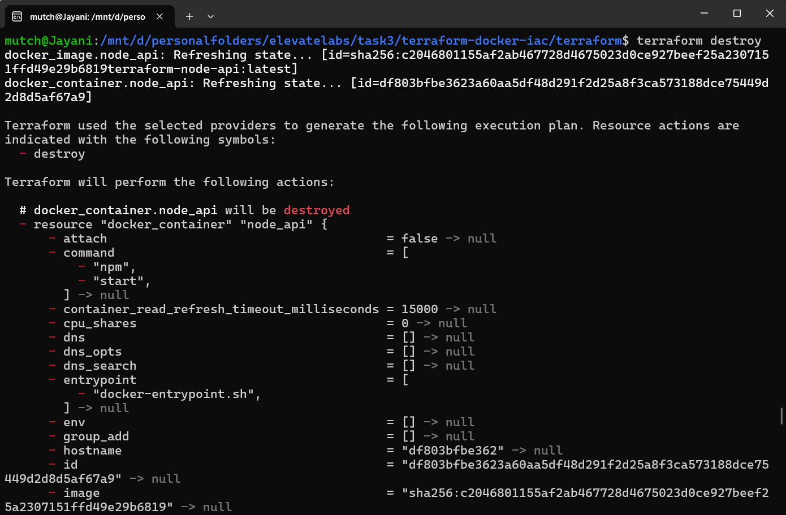

# Terraform Infrastructure as Code (IaC) for Node.js Application

> Provision and manage a Dockerized Node.js application using Terraform and Docker Provider.

---

# Project Overview

This project demonstrates **Infrastructure as Code (IaC)** using **Terraform** to provision and manage a Dockerized Node.js application.

Instead of manually building Docker images and creating containers, Terraform automates the entire infrastructure provisioning process. The application is built from a custom Dockerfile, deployed as a Docker container, and managed entirely through Terraform configuration files.

This project provides hands-on experience with Infrastructure as Code, Terraform resources, Docker Provider, state management, and automated infrastructure provisioning.

---

# Objectives

- Learn Infrastructure as Code (IaC)
- Provision Docker infrastructure using Terraform
- Build a custom Docker image using Terraform
- Deploy a Node.js application automatically
- Understand Terraform state management
- Practice infrastructure lifecycle management

---

# Features

- Infrastructure as Code using Terraform
- Docker Provider Integration
- Custom Node.js Docker Image
- Automatic Docker Image Build
- Automatic Container Provisioning
- Configurable Variables
- Terraform Outputs
- State Management
- Infrastructure Lifecycle (Create & Destroy)
- Professional Project Structure

---

# Architecture

```text
                 Developer
                     │
             Execute Terraform
                     │
                     ▼
              Terraform CLI
                     │
                     ▼
            Docker Provider
                     │
          ┌──────────┴──────────┐
          ▼                     ▼
   Build Docker Image      Create Container
          │                     │
          └──────────┬──────────┘
                     ▼
           Node.js REST API
                     │
                     ▼
        http://localhost:3002
```

---

# Infrastructure Workflow

The infrastructure lifecycle follows these steps:

1. Initialize Terraform
2. Validate Configuration
3. Review Execution Plan
4. Build Docker Image
5. Create Docker Container
6. Verify Application
7. Inspect Terraform State
8. Destroy Infrastructure

---

# Project Structure

```text
terraform-nodejs-iac/
│
├── app/
│   ├── src/
│   ├── tests/
│   ├── Dockerfile
│   ├── package.json
│   └── package-lock.json
│
├── terraform/
│   ├── versions.tf
│   ├── variables.tf
│   ├── terraform.tfvars
│   ├── main.tf
│   └── outputs.tf
│
├── screenshots/
│
├── README.md
├── LICENSE
└── .gitignore
```

---

# Technology Stack

| Category | Technology |
|-----------|------------|
| Infrastructure as Code | Terraform |
| Container Platform | Docker |
| Provider | Docker Provider |
| Backend | Node.js |
| Framework | Express.js |
| Testing | Jest |
| Version Control | Git & GitHub |

---

# Application Endpoints

| Method | Endpoint | Description |
|---------|----------|-------------|
| GET | `/` | Application Information |
| GET | `/health` | Health Status |
| GET | `/deployment` | Deployment Information |

---

# Terraform Commands

Initialize Terraform

```bash
terraform init
```

Format Configuration

```bash
terraform fmt
```

Validate Configuration

```bash
terraform validate
```

Preview Infrastructure

```bash
terraform plan
```

Provision Infrastructure

```bash
terraform apply
```

Inspect State

```bash
terraform state list
```

Destroy Infrastructure

```bash
terraform destroy
```

---

# Terraform Resources

This project provisions the following resources:

- Docker Image
- Docker Container

Terraform automatically:

- Builds the Docker image from the local Dockerfile
- Creates the container
- Maps application ports
- Stores infrastructure state
- Cleans up infrastructure when destroyed

---

# Project Screenshots

## Terraform Initialization



---

## Terraform Execution Plan



---

## Infrastructure Provisioned



---

## Running Application



---
g
## Infrastructure Destroyed



---

# Project Highlights

- Infrastructure as Code
- Terraform Docker Provider
- Custom Docker Image Build
- Automated Container Provisioning
- Configurable Infrastructure
- Terraform State Management
- Infrastructure Lifecycle Automation
- Modular Project Structure

---

# Future Enhancements

- Remote Terraform State (AWS S3)
- Terraform Workspaces
- Multi-Container Deployment
- Docker Compose Integration
- Kubernetes Provisioning
- AWS Infrastructure Deployment
- Azure Infrastructure Deployment
- GCP Infrastructure Deployment

---

# Interview Concepts Covered

- Infrastructure as Code (IaC)
- Terraform
- Terraform Providers
- Terraform Resources
- Terraform Variables
- Terraform Outputs
- Terraform State
- Docker Provider
- Docker Image
- Docker Container
- Infrastructure Lifecycle
- Terraform Plan vs Apply
- Terraform Destroy

---

# Author

**Mutcherla Jayani**

Aspiring DevOps Engineer with hands-on experience in Terraform, Docker, Jenkins, GitHub Actions, CI/CD, and Infrastructure Automation.

---

# License

This project is licensed under the MIT License.